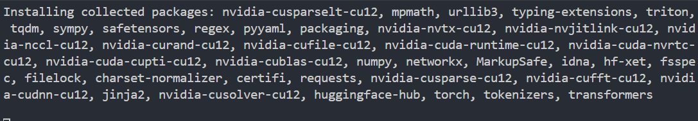

# メモ

## 2025年5月10日
### 内容
#### Hugging Face
- 参考資料
  - [Hugging Faceとは](https://www.sbbit.jp/article/cont1/122042)
- 仮想環境
  - なんかこれを使ってPythonのプロジェクトを分けておく
  - ```python3 -m venv venv```で仮想環境を作成
- ```pip install transformers torch```でめちゃくちゃ時間がかかっている
  - fransformersの部分で固まっている
  
- なんやかんやで実行完了した
  - 原文
    >You all went crazy.Instead of arguing with every opinion separately, I just want to ask one question: Why are you doing competitive programming? Is it to get to 1600 rating and put it on the resume? If so, please use AI, cheat, and do everything possible to get to 1600 as soon as possible and get the f**k out of this platform. And if you are (not) a normal person and do competitive programming because it is fun to solve problems, do you think it is fun to copy the problem statement into an AI model prompt and then copy the code it spews to submit? And why do you assume that everyone else will do that if there will be such an opportunity? The same goes for cheaters. Yes, some people do not do this as a sport, for fun. Why do you care?I do think that AI is ruining competitive programming. By proxy. And that proxy is all of you who are running around yelling "We will all die, somebody do something about AI". I have seen a couple of comments saying "authors/coordinators must make sure that problems are not solvable by AI". NO. STOP THIS. You are forgetting that all of this was for fun in the first place. Competitive programming should be fun for HUMANS, not inaccessible to AI. Remember this blog? Do you think AI couldn't guess the solution print(input())? So, do you want to ban what we collectively agree to be one of the best div2A ever just because "a machine can guess it"?I hope this can be a wake-up call. A chance to remember that this was supposed to be a fun activity for us to enjoy. Lately, I feel like we (as a community) were focusing too much on the negatives (cheating and now AI).Actually, there was one more "negative" thing we were trying to combat... I'll throw it here, even though this is a fringe opinion and will probably reduce the impact of the blog. Welp, who cares, I'm doing this FOR FUN.
  - 要約結果
    >[{'summary_text': ' Competitive programming should be fun for humans, not inaccessible to AI, he says . I hope this can be a wake-up call. A chance to remember that this was supposed to be a fun activity .'}]